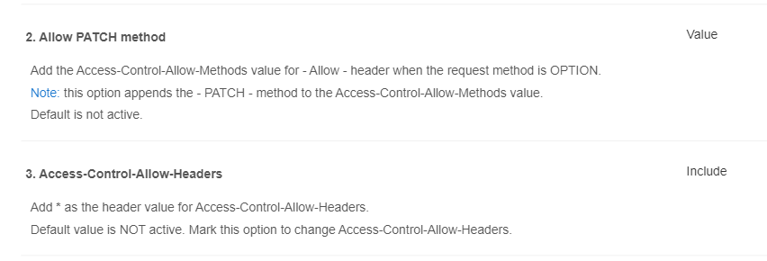

# Database-Project

First, this project is running on a database hosted online. To run it locally, you need to make a database called testdb2 on your localhost.

```
USE SCHEMA my_schema
CREATE DATABASE testdb2;
```

Also make sure you have a user called testuser with all privilege.

```
CREATE ROLE testuser LOGIN PASSWORD '123'
GRANT ALL ON testdb2 TO testuser
```

Moreover, to Run this project, you need to do run the following in order

```bash
cd Backend
npm i
cd Starting project
npm i
node ResetDB
node server
```

and then open up another terminal in the root directory and run the following

```bash
npm i
cd Frontend
npm i
npm run dev
```

Most importantly, make sure you have the [cors](https://chromewebstore.google.com/detail/allow-cors-access-control/lhobafahddgcelffkeicbaginigeejlf?hl=en) extension installed on your browser <br>
After installing it and turning it on, make sure to check the options for the 'Allow Patch Method' and 'Access-control-Allow-Headers'


Finally, open up the localhost [link](http://localhost:5173/) on your browser and you're good to go!
